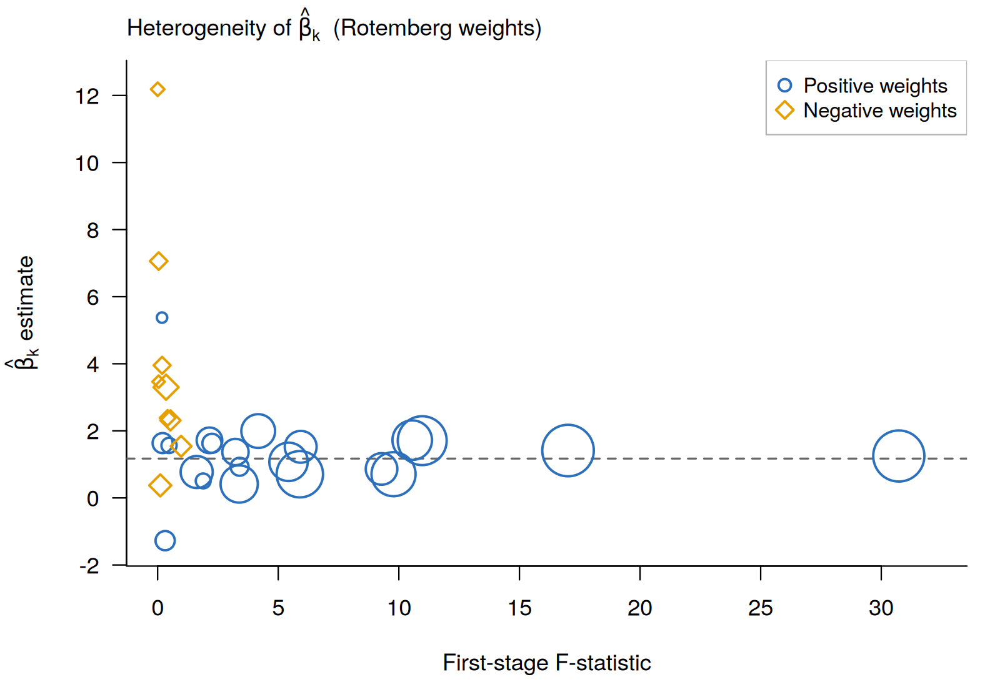
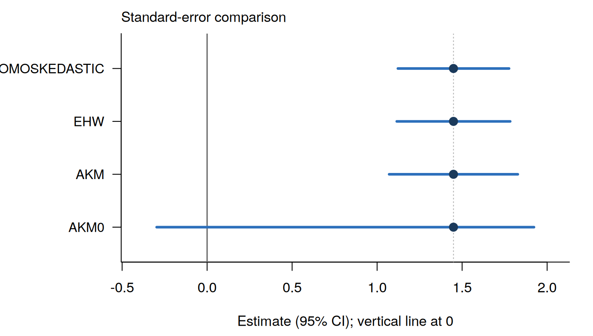

# ssBartik: R package for an end-to-end pipeline for shift-share / Bartik IV designs

[](https://github.com/takuma1102/ssBartik/actions/workflows/R-CMD-check.yaml)
[](https://lifecycle.r-lib.org/articles/stages.html#experimental)

Shift-share / Bartik IV analysis in R is currently spread across several excellent but single-purpose tools, each
of which has its own data conventions. `ssBartik` connects those steps
into one consistent workflow: **variable construct → diagnose → estimate → infer →
visualize**, organized around the two identification routes of the modern
literature (i.e., exogeneous **shift** and exogenous **share** approaches).

Once you pick the identification route with a single
argument (`exogenous = "share"` or `"shift"`); everything downstream follows from variable construction and iagnostics to visualization.

## Installation

```r
# install.packages("remotes")
remotes::install_github("takuma1102/ssBartik")
```

`ShiftShareSE` by Prof. Michal Kolesár (for AKM/AKM0 inference) is
optional and used when installed.

## Quick start

```r
library(ssBartik)

# one call: build the design and run the full pipeline
res <- ssbartik(df$data, df$shares, df$shocks,
                controls = "w1", weights = "pop",
                exogenous = "share",       # or "shift"; each analysist has to pick the right identification design
                covariates = "w1")
res                                        # printed estimate + diagnostics

autoplot(res)                              # headline Rotemberg figure
autoplot(res$estimate)                     # side-by-side SE comparison
```

Or step through it explicitly:

```r
d   <- ssb_design(df$data, df$shares, df$shocks,
                  controls = "w1", weights = "pop", exogenous = "share")
rot <- ssb_rotemberg(d)                    # Rotemberg-weight decomposition
est <- ssb_estimate(d)                     # naive / EHW / cluster / AKM / AKM0
ssb_plot_rotemberg(rot)
ssb_plot_se(est)
```

## The two routes

The instrument `z_i = Σ_n s_{in} g_n` is **constructed identically** whichever
route you take. The `exogenous` flag governs which diagnostics and controls
apply:

| step | `exogenous = "share"` (GPSS 2020) | `exogenous = "shift"` (BHJ 2022) |
|------|-----------------------------------|----------------------------------|
| headline diagnostic | Rotemberg weights + figure | effective shocks / exposure concentration |
| credibility check   | share balance vs. observables | shock balance (hook) |
| robustness          | leave-one-sector-out | leave-one-sector-out |
| pre-period          | pre-trend check | pre-trend check |
| extra control       | — | sum-of-shares (auto, when incomplete) |
| inference           | EHW / cluster / AKM / AKM0 | EHW / cluster / AKM / AKM0 |

## The headline figure

`ssb_plot_rotemberg()` reproduces the canonical Goldsmith-Pinkham–Sorkin–Swift
diagnostic: each sector's just-identified estimate against its first-stage
F-statistic, bubble area proportional to the absolute Rotemberg weight, positive
weights as blue open circles and negative as amber open diamonds, with the
overall estimate marked by the dashed line.



*The design of this figure follows the Rotemberg-weight visualisation in Goldsmith-Pinkham, Sorkin & Swift (2020).*

`ssb_plot_se()` puts the point estimate next to every SE method's interval, with
the axis always including the null at 0, so both the practical cost of the
exposure-robust correction *and* each method's verdict on significance are
immediate. (In this example the naive/EHW interval excludes 0 while AKM0 does
not.)



## Function map

| function | purpose |
|----------|---------|
| `ssb_design()` / `ssbartik()` | define a design / one-call pipeline |
| `ssb_rotemberg()` | Rotemberg-weight decomposition |
| `ssb_estimate()` | point estimate + naive/EHW/cluster/AKM/AKM0 SEs |
| `ssb_shock_summary()` | effective number of shocks, exposure concentration |
| `ssb_loo()` | leave-one-sector-out sensitivity |
| `ssb_share_balance()` | share-vs-observables balance (share route) |
| `ssb_recenter()` | recentering (Borusyak & Hull) |
| `ssb_pretrend()`, `ssb_shock_balance()` | pre-trend / shock-balance (v0.1 hooks) |
| `ssb_plot_rotemberg()`, `ssb_plot_se()` | figures |

## Status (v0.1)

Working and validated: instrument construction (cross-section and
sector×period panels), Rotemberg decomposition (weights sum to one; the overall
estimate matches the 2SLS estimate exactly by FWL), the SE panel (the native
point estimate matches `ShiftShareSE` to machine precision), shock summary,
leave-one-out, share balance, and demean-recentering.

Planned next: `.Rd` help pages via roxygen; a native `ssaggregate`-style
shock-level regression and equivalence check; permutation-based recentering;
full shock-balance and pre-trend tests carried by the design object.

## Acknowledgements & references

`ssBartik` stands on tools built by others, gratefully:
[**ShiftShareSE**](https://github.com/kolesarm/ShiftShareSE) (Michal Kolesár),
[**ssaggregate**](https://github.com/kylebutts/ssaggregate) (Kyle Butts),
[**bartik.weight**](https://github.com/jjchern/bartik.weight) (JJ Chern), and
[**bartik-weight**](https://github.com/paulgp/bartik-weight) (Paul Goldsmith-Pinkham,
the original Stata implementation).

Methods:

- Adão, Kolesár & Morales (2019), *Shift-Share Designs: Theory and Inference*, QJE.
- Borusyak, Hull & Jaravel (2022), *Quasi-Experimental Shift-Share Research Designs*, REStud.
- Borusyak, Hull & Jaravel (2025), *A Practical Guide to Shift-Share Instruments*, Journal of Economic Perspectives.
- Borusyak, Hull & Jaravel (2025), *Design-based identification with formula instruments: a review*, The Econometrics Journal.
- Goldsmith-Pinkham, Sorkin & Swift (2020), *Bartik Instruments: What, When, Why, and How*, AER.

## License

MIT © 2026 Takuma Iwasaki (Stanford University).
