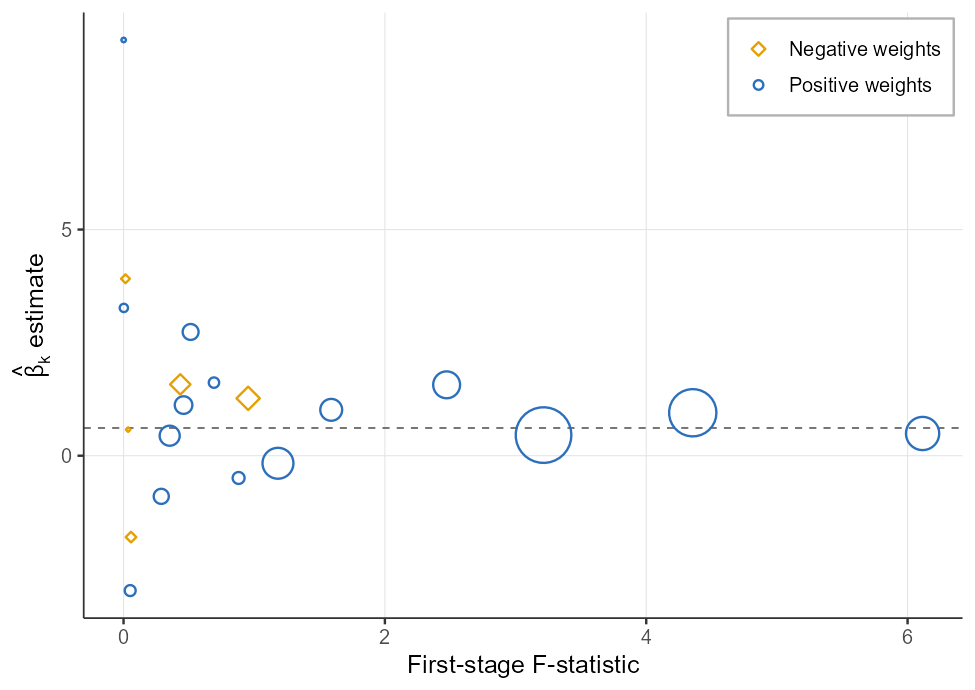
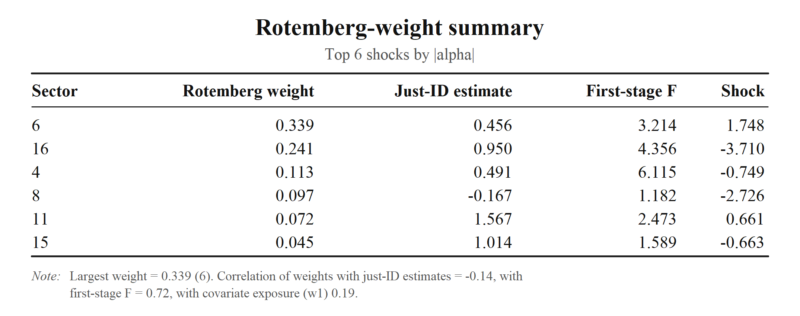
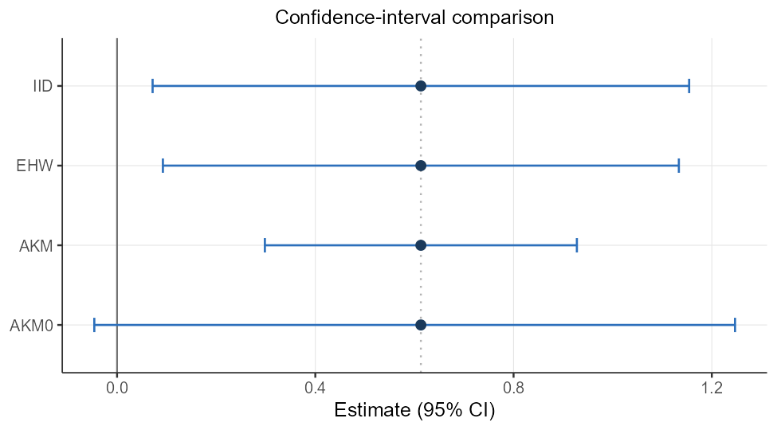
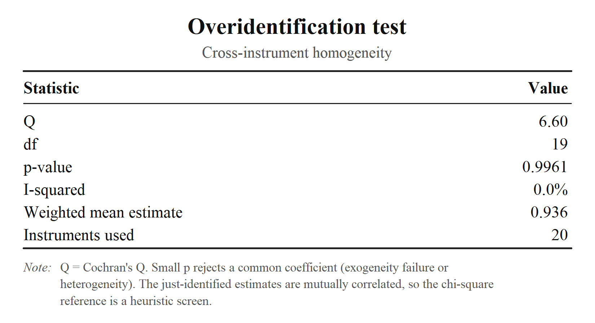
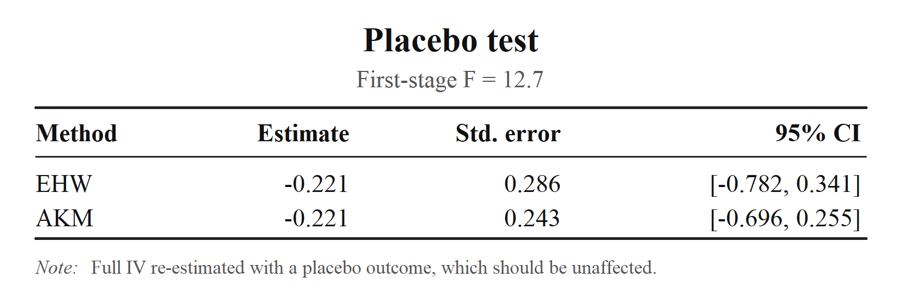
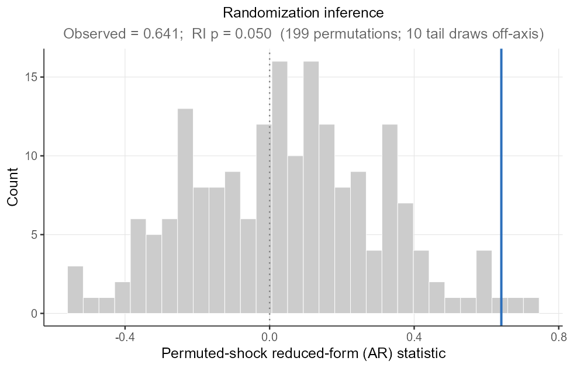
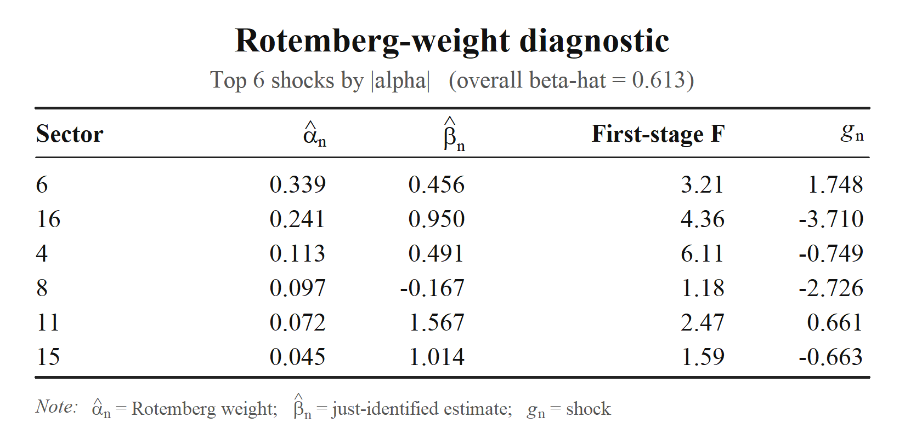
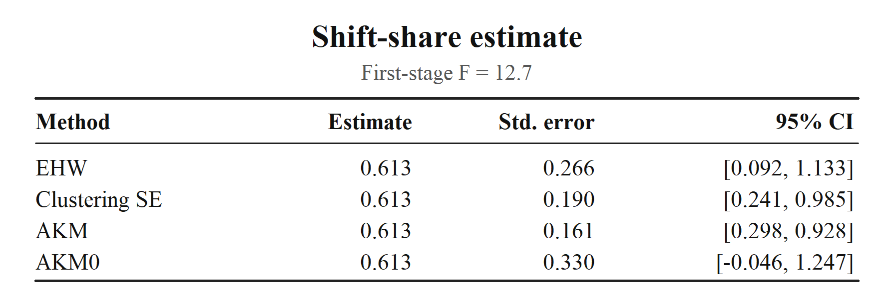
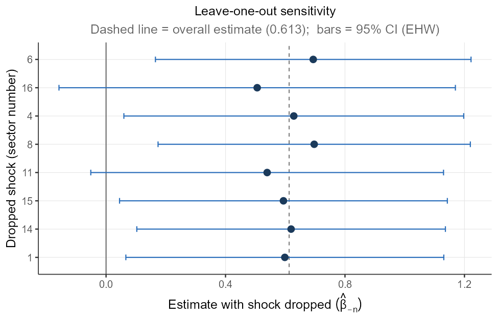
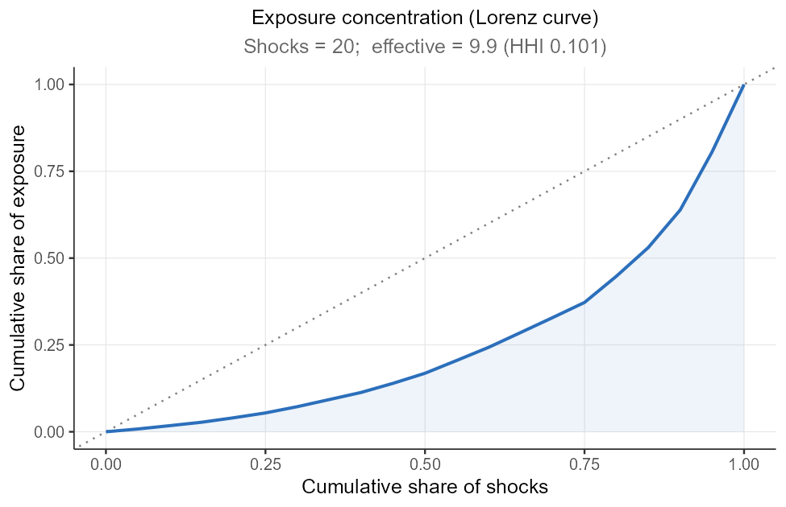

# ssBartik: R package for an end-to-end pipeline for shift-share (Bartik) IV designs

[](https://github.com/takuma1102/ssBartik/actions/workflows/R-CMD-check.yaml)
[](https://github.com/takuma1102/ssBartik/actions/workflows/pkgdown.yaml)
[](https://takuma1102.r-universe.dev/ssBartik)
[](https://lifecycle.r-lib.org/articles/stages.html#experimental)
[](https://takuma1102.github.io/ssBartik/LICENSE)

Shift-share / Bartik IV analysis in R is currently spread across several
single-purpose tools, each of which has its own data conventions.
`ssBartik` connects those steps into one consistent workflow: (a)
construct variables → (b) diagnose → (c) estimate → (d) infer → (e)
visualize, organized around the two identification routes of the modern
literature (i.e., exogenous **shift** and exogenous **share**
approaches).

Once you pick the identification route with a single argument
(`exogenous = "share"` or `"shift"`), everything downstream follows
through simple functions.

## Headline visualizations and tables

`ssBartik` turns estimation and diagnostic results into
publication-ready figures and tables. The examples below demonstrate
some of the package’s main outputs using sample datasets. The first
model figure follows visualization in Goldsmith-Pinkham, Sorkin, and
Swift (2020).



## Install

``` r

# install.packages("remotes")
remotes::install_github("takuma1102/ssBartik")
```

`ShiftShareSE` by Prof. Michal Kolesár (for AKM/AKM0 inference) is
optional and used when installed.

## One-call pipeline

The `ssBartik` function builds the dataset for shift-share IV analysis,
runs the full pipeline, and produces results regarding a CI comparison
between AKM/AKM0 and conventional methods, a calculation of the
effective F, an overidentification test, Rotemberg weights, a pre-trend
test, a placebo analysis, and an LOO analysis.

``` r

library(ssBartik)
pipeline_analysis <- ssbartik(data = data, shares = shares, shocks = shocks, controls = "w1", weights = "pop",
                exogenous = "share",     # or "shift" 
                covariates = "w1",
                pre_y = "ypre", placebo_y = "yplac")
print(pipeline_analysis)                   # printed estimate + diagnostics
```

## The two routes

The instrument `z_i = Σ_n s_{in} g_n` is **constructed identically**
whichever route you take. The `exogenous` flag governs which diagnostics
and controls apply:

| step | `exogenous = "share"` (GPSS) | `exogenous = "shift"` (AKM, BHJ) |
|----|----|----|
| headline diagnostic | Rotemberg weights + figure | effective shocks / exposure concentration |
| credibility check | share balance vs. observables | shock balance vs. characteristics |
| cross-instrument | overidentification across β_k | location ↔︎ shock IV equivalence |
| pre-period / placebo | pre-trend + placebo outcome | pre-trend + placebo outcome |
| robustness | leave-one-out, drop-top-n, randomization inference | leave-one-out, drop-top-n, randomization inference |
| extra control | — | sum-of-shares (auto, when incomplete) |
| inference | EHW / AKM / AKM0 (cluster, two-way on request) | EHW / AKM / AKM0 (cluster, two-way on request) |

## Step-by-step analysis

With a design in hand, each credibility check is finished through a
single call.

``` r

d   <- ssb_design(df$data, df$shares, df$shocks,
                  controls = "w1", weights = "pop", exogenous = "share")
rot <- ssb_rotemberg(d)                    # Rotemberg-weight decomposition
plot(rot, n = 6)                           # see below
```



``` r

est <- ssb_estimate(d)                     # IID / EHW / AKM / AKM0 (add cluster/two-way on request)
ssb_plot_ci(est)
```



``` r

# instrument strength & internal consistency
ssb_first_stage(d)               # standard robust F + exposure-robust "effective" F
ssb_equivalence(d)               # location-level SSIV == shock-level IV (sanity check)
ssb_overid(d)                    # do the per-share estimates agree? (Cochran's Q)
```



``` r

# identifying-assumption checks
ssb_shock_balance(d, shock_covariates = sc)  # shocks vs. pre-determined characteristics
ssb_pretrend(d, pre_y = "y_pre")             # does exposure predict pre-trends?
ssb_placebo(d, placebo_y = "y_plac")         # full IV on an outcome that shouldn't move
```



``` r

ssb_ri(d, R = 999, block = "grp")            # AR-style randomization inference (shocks permuted within blocks)
```



``` r

# sensitivity to influential shocks
ws<- ssb_weight_summary(d, covariates = "w1")     # who carries the weight? (α vs. βₖ, F, covariates)
plot(ws)
```



``` r

ssb_drop_top(d, n = 5)                        # re-estimate without the top-weight shocks
ssb_recenter(d, method = "permute", block = "grp")     # block-wise recentering (within-block mean shock)
```

Each returns a small object with a readable
[`print()`](https://rdrr.io/r/base/print.html) method; the same checks
run automatically inside
[`ssbartik()`](https://takuma1102.github.io/ssBartik/reference/ssbartik.md)
/
[`ssb_pipeline()`](https://takuma1102.github.io/ssBartik/reference/ssb_pipeline.md)
when you pass the corresponding arguments (`pre_y`, `placebo_y`,
`shock_covariates`, `covariates`).

## Function map

**Construct**

| function | purpose |
|----|----|
| [`ssb_design()`](https://takuma1102.github.io/ssBartik/reference/ssb_design.md) | define a shift-share design (entry point) |
| [`ssbartik()`](https://takuma1102.github.io/ssBartik/reference/ssbartik.md) / [`ssb_pipeline()`](https://takuma1102.github.io/ssBartik/reference/ssb_pipeline.md) | one-call pipeline (from raw data / from an existing design) |

**Diagnose**

| function | purpose |
|----|----|
| [`ssb_rotemberg()`](https://takuma1102.github.io/ssBartik/reference/ssb_rotemberg.md) | Rotemberg-weight decomposition (+ [`format()`](https://rdrr.io/r/base/format.html)/[`plot()`](https://rdrr.io/r/graphics/plot.default.html) paper table) |
| [`ssb_weight_summary()`](https://takuma1102.github.io/ssBartik/reference/ssb_weight_summary.md) | Rotemberg-weight summary + correlations (α vs. βₖ, F, covariates) |
| [`ssb_shock_summary()`](https://takuma1102.github.io/ssBartik/reference/ssb_shock_summary.md) | effective number of shocks, exposure concentration |
| [`ssb_first_stage()`](https://takuma1102.github.io/ssBartik/reference/ssb_first_stage.md) | first-stage strength: standard & exposure-robust (effective) F |

> **Note** The Rotemberg decomposition is the headline credibility table
> of the exogenous-shares approach (Goldsmith-Pinkham, Sorkin & Swift
> 2020): it shows which shocks the estimate leans on and whether their
> just-identified estimates agree.
> [`ssb_rotemberg()`](https://takuma1102.github.io/ssBartik/reference/ssb_rotemberg.md)
> prints a console summary by default, and exports a publication-quality
> table of the top-weight shocks on demand:

``` r

rot <- ssb_rotemberg(d)
print(rot)                                 # console summary (default)

writeLines(format(rot, "latex"))           # paste-ready booktabs LaTeX
writeLines(format(rot, "markdown"))        # GitHub pipe table
print(rot, format = "latex", n = 8)        # same, straight from print()

plot(rot, file = "rotemberg_table.png")    # compact booktabs image (.png/.pdf); see below
```

**Estimate & infer**

| function | purpose |
|----|----|
| [`ssb_estimate()`](https://takuma1102.github.io/ssBartik/reference/ssb_estimate.md) | point estimate + confidence intervals: IID/EHW/AKM/AKM0 by default, cluster/two-way on request (+ [`format()`](https://rdrr.io/r/base/format.html) paper table) |



| function | purpose |
|----|----|
| [`ssb_aggregate()`](https://takuma1102.github.io/ssBartik/reference/ssb_aggregate.md) / [`ssb_shock_iv()`](https://takuma1102.github.io/ssBartik/reference/ssb_shock_iv.md) | shock-level aggregation and shock-level IV |
| [`ssb_equivalence()`](https://takuma1102.github.io/ssBartik/reference/ssb_equivalence.md) | location-level ↔︎ shock-level IV equivalence check |

**Credibility & robustness checks**

| function | purpose |
|----|----|
| [`ssb_overid()`](https://takuma1102.github.io/ssBartik/reference/ssb_overid.md) | overidentification / cross-instrument homogeneity test |
| [`ssb_share_balance()`](https://takuma1102.github.io/ssBartik/reference/ssb_share_balance.md) | share-vs-observables balance (share route) |
| [`ssb_shock_balance()`](https://takuma1102.github.io/ssBartik/reference/ssb_shock_balance.md) | shock-vs-characteristics balance (shift route) |
| [`ssb_pretrend()`](https://takuma1102.github.io/ssBartik/reference/ssb_pretrend.md) | pre-trend test (reduced form of a pre-period outcome on the instrument) |
| [`ssb_placebo()`](https://takuma1102.github.io/ssBartik/reference/ssb_placebo.md) | placebo-outcome test (full IV on an outcome that should not move) |
| [`ssb_ri()`](https://takuma1102.github.io/ssBartik/reference/ssb_ri.md) | randomization inference (Anderson-Rubin-style placebo shocks) |
| [`ssb_loo()`](https://takuma1102.github.io/ssBartik/reference/ssb_loo.md) | leave-one-sector-out sensitivity |



| function | purpose |
|----|----|
| [`ssb_drop_top()`](https://takuma1102.github.io/ssBartik/reference/ssb_drop_top.md) | re-estimate after dropping the top-weight shocks together |
| [`ssb_recenter()`](https://takuma1102.github.io/ssBartik/reference/ssb_recenter.md) | recentering — demean or block-wise permute (Borusyak & Hull) |

**Visualize**

| function | purpose |
|----|----|
| [`ssb_plot_rotemberg()`](https://takuma1102.github.io/ssBartik/reference/ssb_plot_rotemberg.md) / [`ssb_plot_ci()`](https://takuma1102.github.io/ssBartik/reference/ssb_plot_ci.md) | Rotemberg bubble chart / confidence-interval comparison |
| [`ssb_plot_loo()`](https://takuma1102.github.io/ssBartik/reference/ssb_plot_loo.md) / [`ssb_plot_ri()`](https://takuma1102.github.io/ssBartik/reference/ssb_plot_ri.md) | leave-one-out sensitivity / randomization-inference null |
| [`ssb_plot_overid()`](https://takuma1102.github.io/ssBartik/reference/ssb_plot_overid.md) / [`ssb_plot_shocks()`](https://takuma1102.github.io/ssBartik/reference/ssb_plot_shocks.md) | just-identified estimate dispersion / exposure Lorenz curve |



| function | purpose |
|----|----|
| [`autoplot()`](https://ggplot2.tidyverse.org/reference/autoplot.html) | method for any of the figures above |

> **Note 1**:
> [`ssb_plot_rotemberg()`](https://takuma1102.github.io/ssBartik/reference/ssb_plot_rotemberg.md)
> reproduces the canonical Goldsmith-Pinkham–Sorkin–Swift diagnostic:
> each sector’s just-identified estimate against its first-stage
> F-statistic, bubble area proportional to the absolute Rotemberg
> weight, positive weights as blue open circles and negative as amber
> open diamonds, with the overall estimate marked by the dashed line.

> **Note 2**:
> [`ssb_plot_ci()`](https://takuma1102.github.io/ssBartik/reference/ssb_plot_ci.md)
> puts the point estimate next to every method’s interval, with the axis
> always including the null at 0, so both the practical cost of the
> exposure-robust correction *and* each method’s verdict on significance
> are immediate. The comparison is of *intervals*: AKM0 is defined
> directly as a (possibly asymmetric) interval, so it is the interval —
> not a standard error — that matters. (In this example the naive/EHW
> interval excludes 0 while AKM0 does not.)

## Status

Experimental, but the output schema is intended to be stable. Pin
package versions in production code.

## Acknowledgements

When developing `ssBartik`, I gratefully referenced tools built by
others: [**ShiftShareSE**](https://github.com/kolesarm/ShiftShareSE)
(Michal Kolesár),
[**ssaggregate**](https://github.com/kylebutts/ssaggregate) (Kyle
Butts), [**bartik.weight**](https://github.com/jjchern/bartik.weight)
(JJ Chern), and
[**bartik-weight**](https://github.com/paulgp/bartik-weight) (Paul
Goldsmith-Pinkham for Stata and R). Kudos to their authors for making
these ideas legible and reproducible.

To keep the package lightweight and close to base R, `ssBartik` depends
on only `ShiftShareSE`, listed under Suggests and called solely for the
AKM / AKM0 exposure-robust standard errors. The other three packages
above are neither imported nor called. They served purely as references
and the functionality they built is reimplemented natively in `ssBartik`
in base R so that external dependencies stay minimal.

## Citation

Please also cite whichever underlying methods and tests you actually
used.

- Adão, Kolesár & Morales (2019), *Shift-Share Designs: Theory and
  Inference*, QJE.
- Borusyak, Hull & Jaravel (2022), *Quasi-Experimental Shift-Share
  Research Designs*, REStud.
- Borusyak and Hull (2026) *Optimal formula instruments*, Econometrica
  (forthcoming).
- Borusyak, Hull & Jaravel (2025), *A Practical Guide to Shift-Share
  Instruments*, Journal of Economic Perspectives.
- Borusyak, Hull & Jaravel (2025), *Design-based identification with
  formula instruments: a review*, The Econometrics Journal.
- Goldsmith-Pinkham, Sorkin & Swift (2020), *Bartik Instruments: What,
  When, Why, and How*, AER.

## License

MIT © 2026 Takuma Iwasaki (Stanford University).
